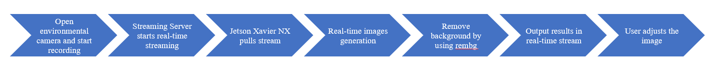
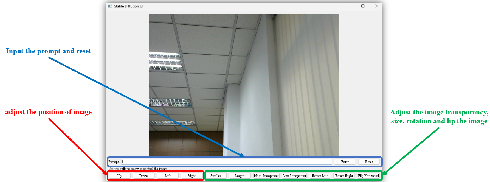
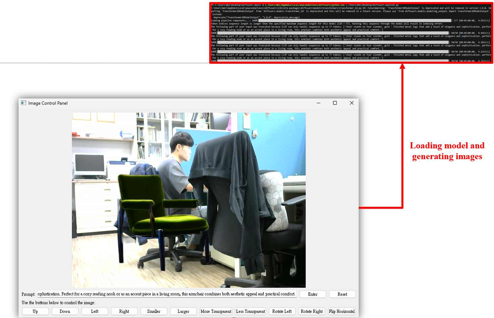
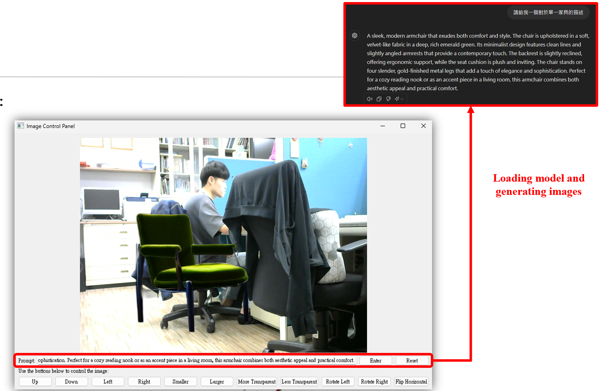
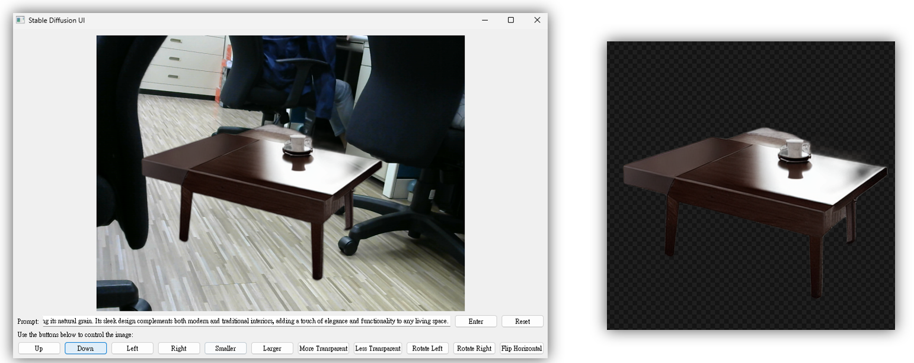

# Generative-AI-Generated-Furniture

This is the final project of COMPUTER VISION IN DEEP LEARNING IMPLEMENTATION AND ITS APPLICATIONS.


# Stable Diffusion UI with PyQt5 in Jetson Xavier NX

This is a GUI application made with PyQt5 in Jetson Xavier NX, combining the Stable Diffusion model with real-time streaming capture. This project allows users to generate images using prompts and perform real-time processing and display of the generated images.


## Function

- Real-time streaming or camera capture
- Generate furniture images using Stable Diffusion
- Real-time image processing: position, scaling, transparency, rotation, flipping
- Remove image background
- GUI control interface

## Flowchart



1. Open the environmental camera and start recording
2. Streaming Server starts real-time streaming
3. Jetson Xavier NX pulls the stream
4. Perform real-time image generation
5. Use rembg to remove the background
6. Generate the results in the real-time stream
7. Users can adjust the image themselves

## Installation 

1. Create and activate the Conda environment:

    ```bash
    conda create --name diffusers-gui python=3.8
    conda activate diffusers-gui
    ```

2. Install CUDA toolkit and CuDNN:

    ```bash
    conda install -c conda-forge cudatoolkit cudnn -y
    ```

3. Install the required Python packages:

    ```bash
    pip install torch==2.0.0+cu118 torchvision==0.15.0+cu118 torchaudio==2.0.0+cu118 -f https://download.pytorch.org/whl/torch_stable.html
    pip install PyQt5==5.15.10 pillow==10.4.0 rembg==2.0.57 numpy==1.24.4 diffusers==0.29.2 transformers==4.42.3 accelerate==0.32.1
    ```

## Using this code

1. run the main program:

    ```bash
    python main.py
    ```

2. In the pop-up GUI, you can generate images by entering prompts and clicking the "Enter" button. Use the control buttons below to adjust the image's position, size, transparency, rotation angle, and flip.

## Results Display

### UI Interface






- 加載模型並生成圖片
- 輸入提示詞並重置
- 調整圖片位置、透明度、大小、旋轉和翻轉


## Dependence

- Python==3.8
- PyQt5==5.15.10
- Pillow==10.4.0
- rembg==2.0.57
- numpy==1.24.4
- torch==2.0.0+cu118
- torchaudio==2.0.0+cu118
- torchvision==0.15.0+cu118
- diffusers==0.29.2
- transformers==4.42.3
- accelerate==0.32.1

## Reference

- [diffusers](https://github.com/huggingface/diffusers)

